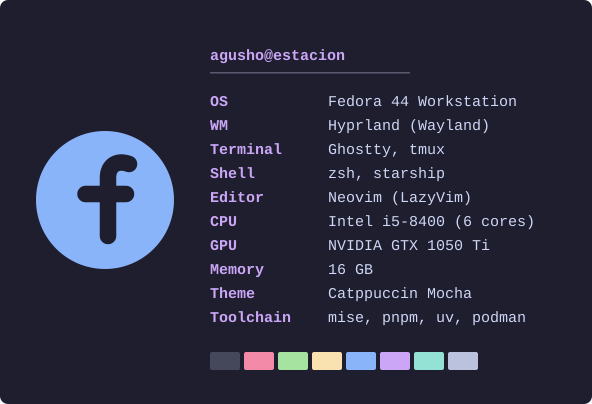

  

### `❯ cat about.md`

I build open source tooling for Linux: the kind of thing that fixes one annoying
problem properly and then gets out of the way. Everything I publish is
documented in Spanish and commented to explain **why**, not just what, because
the reasoning is the part that usually goes missing.

The goal is simple: leave behind more free code than I consume.

### `❯ contribute --where`

I'm looking for projects to contribute to. Where I can genuinely help today:

- **Linux desktop tooling** — Wayland and Hyprland, shell scripting, dotfile management
- **Developer environments** — terminal tooling, editor config, reproducible setups
- **Self-hosting and containers** — rootless Podman, small services built to run at home
- **Spanish documentation** — good tooling stays invisible to people who don't read English. Translating docs is a real contribution and I'm glad to do it.

Maintain something in that space? Open an issue on any repo below, or point me
at one of yours.

### `❯ ls -l ~/projects`

| Project | What it does | |
|:--|:--|:--|
| [**centinela**](https://github.com/Agusho-dev/centinela) | Your Linux box freezes and nothing steps in. Memory-thrashing diagnosis plus a daemon that ties the hardware watchdog to real health checks, so it reboots when the system is alive but useless. | `Shell` `MIT` |
| [**estacion**](https://github.com/Agusho-dev/estacion) | The workstation below, documented end to end. Every config file explains the reasoning behind it, not just the setting. | `Shell` `MIT` |

Everything else is public at [@Agusho-dev](https://github.com/Agusho-dev?tab=repositories).

### `❯ stack --list`

  
  
  
  
  

  
  
  
  
  

  
  
  
  

### `❯ fastfetch`

Not a screenshot: that's the actual machine, and it's documented file by file in
[estacion](https://github.com/Agusho-dev/estacion). Building it is how I learned
most of what I know about Linux, which is why the comments in there are written
for someone who is still learning.

### `❯ contact`

Want to work on one of these, or need a hand with something you maintain? Open
an issue or start a discussion. That's the fastest way to reach me.

I also build software for small businesses in Córdoba. If that's what
brought you here, the door is open too.

---

<b>❯ cat about.md --lang es</b>

 

### `❯ cat sobre-mi.md`

Construyo herramientas libres para Linux: de esas que resuelven bien un
problema molesto y después se corren del camino. Todo lo que publico está
documentado en español y comentado explicando el **porqué**, no solo el qué,
porque el razonamiento es lo que siempre se pierde.

La meta es simple: dejar más código libre del que consumo.

### `❯ aportar --donde`

Estoy buscando proyectos a los que contribuir. Donde puedo ayudar de verdad hoy:

- **Herramientas de escritorio Linux** — Wayland e Hyprland, scripting de shell, manejo de dotfiles
- **Entornos de desarrollo** — herramientas de terminal, configuración de editores, setups reproducibles
- **Autohospedaje y contenedores** — Podman rootless, servicios chicos hechos para correr en casa
- **Documentación en español** — mucha herramienta buena es invisible para quien no lee inglés. Traducir documentación es un aporte real y lo hago con gusto.

¿Mantenés algo en ese rubro? Abrí un issue en cualquiera de los repos de abajo,
o mostrame el tuyo.

### `❯ ls -l ~/proyectos`

| Proyecto | Qué hace | |
|:--|:--|:--|
| [**centinela**](https://github.com/Agusho-dev/centinela) | Tu Linux se congela y nadie hace nada. Diagnóstico del thrashing por memoria y un centinela que ata el watchdog de hardware a verificaciones de salud: reinicia cuando el sistema está vivo pero inútil. | `Shell` `MIT` |
| [**estacion**](https://github.com/Agusho-dev/estacion) | La estación de arriba, documentada de punta a punta. Cada archivo de configuración explica el porqué de lo que hace, no solo qué hace. | `Shell` `MIT` |

El resto de mis repos son públicos en
[@Agusho-dev](https://github.com/Agusho-dev?tab=repositories).

### `❯ fastfetch`

El bloque de arriba no es una captura: es la máquina real, documentada archivo
por archivo en [estacion](https://github.com/Agusho-dev/estacion). Armarla es
como aprendí casi todo lo que sé de Linux, y por eso los comentarios están
escritos para alguien que todavía está aprendiendo.

### `❯ contacto`

¿Querés trabajar en alguno de estos, o necesitás una mano con algo que mantenés?
Abrí un issue o una discussion, que es la vía más rápida.

También hago software para pymes en Córdoba. Si es eso lo que te trajo hasta
acá, la puerta también está abierta.

